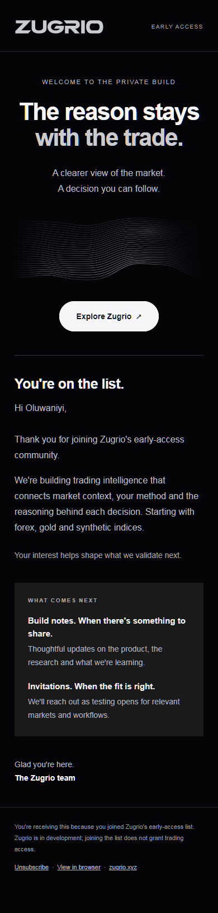

# Zugrio dark welcome email — revised candidate (not sent)

Continuity record: [ZUGRIO_CURRENT_CONTEXT.md](../ZUGRIO_CURRENT_CONTEXT.md), updated 2026-09-26. Read it before editing or sending. [Reconciliation with templates 10–18](RECONCILIATION.md) records the live comparison and differences from the newer repository email standard. This is a separate review candidate, not a replacement for the canonical sequence.

The current local HTML differs from template 9: it now uses the official silver logo PNG, a visible market-topography graphic, a first-name greeting with a neutral fallback, and the sign-off "The Zugrio team". This revised candidate has not been uploaded to Brevo or sent. The test described below applies only to the earlier version.

Historical predecessor only: Brevo template 9, `Zugrio EA00 — Dark editorial design test`. The revised local candidate has no Brevo template ID.
Subject: `You're on the list. Welcome to Zugrio.`

Created inactive as a separate design candidate. Existing templates and scheduled contact sync are unchanged. Explicitly requested test sent only to the account Gmail, oluwajobaoluwaniyi@gmail.com; Brevo accepted the request with HTTP 204. This verifies submission, not inbox delivery.

Local HTML preview checked at 800px and 390px widths with no horizontal overflow. Layout uses presentation tables, inline core styles, system-font fallbacks, dark-mode metadata, and a responsive headline. The revised candidate loads two PNG images from the deployed zugrio-email-assets Worker; it requires no external fonts. Gmail's actual colour transformations and deliverability still require recipient inspection; Apple Mail and Outlook were not tested.

Source: zugrio-welcome-dark.html. Screenshots: preview-800.png and preview-390.png.

## Review from GitHub

[Desktop browser preview](preview-800.png) · [Revised HTML source](zugrio-welcome-dark.html) · [Template reconciliation](RECONCILIATION.md)

The original helper scripts are included as workstation provenance. Their dependency paths refer to the original Codex runtime; use equivalent installed `sharp` and `playwright` packages when adapting them on another machine. The PNG assets are included directly, so reading or reviewing the package does not require running these scripts. The asset-host configuration is archived for context; publishing this PR does not deploy it.
